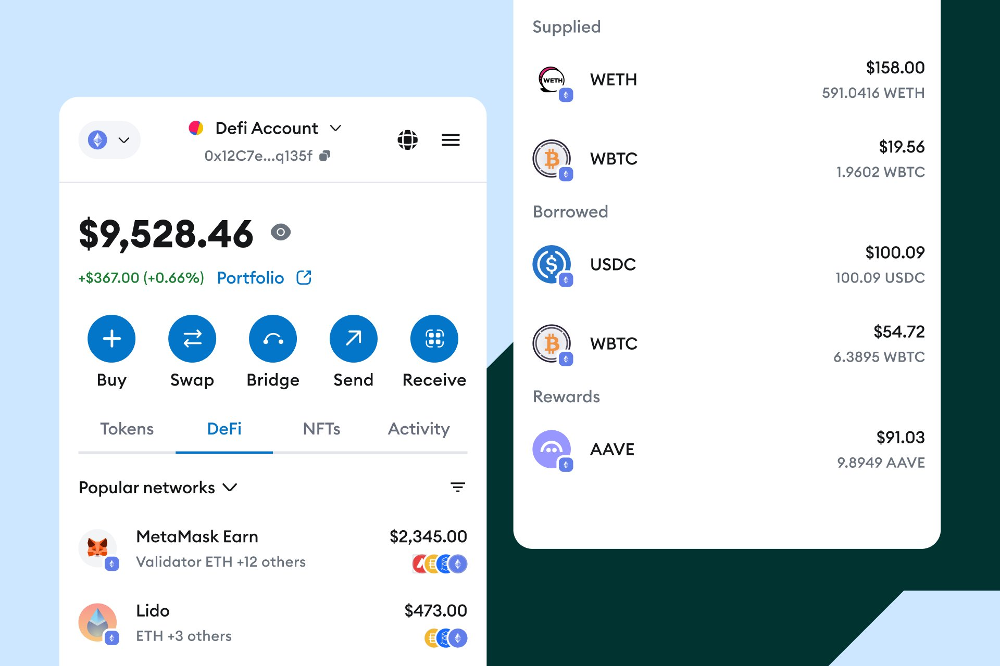

 

**🦊 The world’s leading crypto wallet.**

  

 

_MetaMask DeFi tab, powered by this adapter library._

# Welcome to MetaMask's DeFi Adapter Library! 🦊

This library is designed to simplify and standardise the process of fetching data and interacting with various DeFi protocols, which often have unique interfaces and data structures. Our adapters 1) fetch and transform underlying protocol data into a standardised format that can be easily used by portfolio dashboards and 2) generate transaction params to create and update protocol positions.

[How to create a Read Adapter](./packages/adapters-library/README.md#how-to-create-a-read-adapter)

## Quick Start

Refer to the [adapters-library README](./packages/adapters-library/README.md#setup-steps).

> **Note:** Please note that in this library, adapter must query on-chain data to ensure accuracy and reliability, we do not accept centralised APIs to get positions or rewards.
