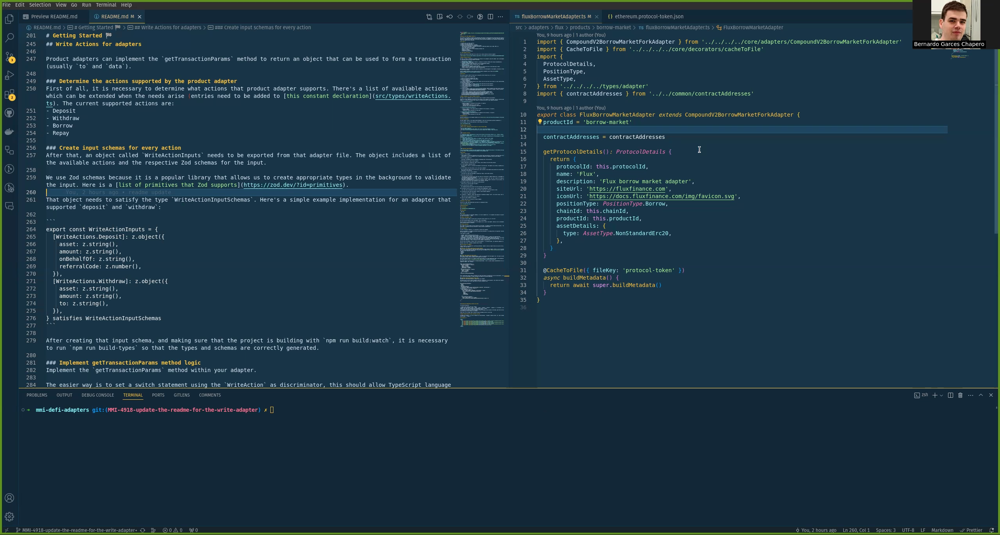

  

# Welcome to our DeFi Adapter Library! 🚀

This library is designed to simplify and standardise the process of fetching data and interacting with various DeFi protocols, which often have unique interfaces and data structures. Our adapters 1) fetch and transform underlying protocol data into a standardised format that can be easily used by portfolio dashboards and 2) generate transaction params to create and update protocol positions.

## How to create Read Adapter

### Setup steps
1. Install:
   - `nvm use` to select the environment
   - `npm i` to install dependencies 
2. Run project:
   - `npm run dev` to run the project
### Building adapter steps
3. Use CLI:
   - `npm run new-adapter` this launches our interactive CLI that will prompt you with a series of questions
### Building Smart Contract Classes from ABIs
4. Save a json file with your abi and add it to your ${protocolName}/contracts/abis/ folder 
5. Run:
   - `npm run build-types` to generate your smart contract classes
### Building your DeFi asset metadata files
6. Implement the buildMetadata function in your adapter.
7. Run:
   - `npm run build-metadata -- -p <protocol-id>` to create your metadata files
### Building your Snapshot tests
8. Populate your test cases file.
6. Run:
   - `npm run build-snapshots -- -p <protocol-id>` to build your snapshot tests

## Add Write-Adapter/GetTransactionParams support

The tutorial video below shows an intro to on how to add write adapter actions to an existing read adapter:

Don't have a read adapter? And don't intend to create a read adapter? Then:

1. Choose the "WriteOnlyAdapterTemplate" on our create-new-adapter-cli
2. Implement the buildMetadata() method and run `npm run build-metadata -- -p <protocol-id>` to create a json file snapshot of your protocol metadata (Note: you can watch Read tutorial video for more info about buildMetadata function or view other implemented adapters)
3. Then follow the video tutorial below:

See section "Write Actions for adapters" below for more information after watching the tutorial.

