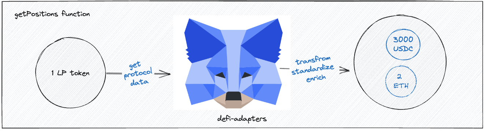

  

# Welcome to our DeFi Adapter Library! 🚀

This library is designed to simplify and standardize the process of fetching and interacting with data from various DeFi protocols, which often have unique interfaces and data structures. Our adapters fetch and transform underlying protocol data into a standardized format that can be easily used by portfolio dashboards.

## Our Goals 🎯

1. Connect users with DeFi protocols
2. Benefit the wider ecosystem
3. Simplify and standardize adapter building
4. Provide the following data in a standardized format:
   - DeFi positions by address, including the balance of underlying tokens such as USDC, WETH, etc.
   - Total Value Locked (TVL) by pool
   - APY/APR by pool
   - Daily profit and loss by address
   - Price of LP token
   - Deposits by address
   - Withdrawals by address
   - Claimed rewards by address

## Overview of this library

From left to right, get-onchain-data and convert to standardize format.

## Overview of getPositions function

## Getting Started 🏁

## Contributing

See [CONTRIBUTING.md](CONTRIBUTING.md).

## Requirements

- Node v18

### Quick Start

To run the project and execute adapters in default mode with our test addresses, follow these steps:

1. Create a copy of `.env.example` as `.env`.
2. Install the necessary packages with `npm i`
3. Build the project with `npm run build:watch`
4. Run the following commands to execute various functions:
   - `npm run positions`
   - `npm run profits`
   - `npm run tvl`
   - `npm run prices`
   - `npm run apr`
   - `npm run apy`
   - `npm run withdrawals`
   - `npm run deposits`

## Installation

Create a copy of `.env.example` as `.env` and run `npm i` to install the necessary packages.

## Building

Use `npm run build` to build the app once, or `npm run build:watch` to constantly build the app during development.

# Running the App 🏃‍♂️

### CLI Help

To get specific details on available commands, run `npm run adapters-cli`. For arguments and options for specific commands, use `npm run positions -- --help`.

### Filtering

You can get results for specific protocols and chains for every command by adding `--chain <chainId>` and/or `--protocol <protocolName>`. For example, `npm run positions 0x6b8Be925ED8277fE4D27820aE4677e76Ebf4c255 -- --protocol stargate --chain 1`.

### Get Positions

To get positions, run `npm run positions 0x6b8Be925ED8277fE4D27820aE4677e76Ebf4c255`.

### Get PnL

To get profit and loss, run `npm run profits 0xB0D502E938ed5f4df2E681fE6E419ff29631d62b`.

### Get Positions

To get positions, run `npm run positions 0x6b8Be925ED8277fE4D27820aE4677e76Ebf4c255`.

### Get PnL

To get profit and loss, run `npm run profits 0xB0D502E938ed5f4df2E681fE6E419ff29631d62b`.

### Get Price Per Share

To get price per share, run `npm run prices`.

### Get Total Value Locked (TVL)

To get TVL, run `npm run tvl`.

### Get APR

To get APR, run `npm run apr`.

### Get APY

To get APY, run `npm run apy`.

### Get Deposits

To get deposits, run `npm run deposits 0x6b8Be925ED8277fE4D27820aE4677e76Ebf4c255 17719334 17719336`.

### Get Withdrawals

To get withdrawals, run `npm run withdrawals 0x6b8Be925ED8277fE4D27820aE4677e76Ebf4c255 17719334 17719336`.

## Adding a new Adapter (CLI)

Run the following command to add a new adapter `npm run new-adapter <Example> <example-product> [Chains]`

Where:

- `<Example>` is the name of your protocol as you'd like it to appear.
- `<example-product>` is the name of the product for the adapter in kebab-case
- `[template]` is the template that will be used (e.g. `SimplePoolAdapter``). Default: `DefaulAdapterTemplate`
- `[chains]` is a list of comma separated list of supported chains (e.g. `Ethereum,Arbitrum,Optimism`). Default: `Ethereum`

## Adding a New Protocol or Adapter manually

See [NON-CLI-ADAPTER.md](NON-CLI-ADAPTER).

## Contract Factories

Add a JSON file with the ABI of any new contract to the folder `src/contracts/abis/<protocol-name>`. Run `npm run build-types` to generate factories and ABIs for those contracts automatically.

### Versioning and Publishing (internal use only)

On your branch, bump the package version by running `npm version [<newversion> | major | minor | patch | premajor | preminor | prepatch | prerelease | from-git]`. The publish_ci pipeline will automatically run when merged to main.

### Update Average Blocks Per Day (internal use only)

To update all averages, run `npm run adapters-cli block-average`. To update a specific chain, run `npm run adapters-cli block-average -- --chain 1`.

## Contributors 🫡

<table>
  <tr>
    <td align="center"><a href="https://github.com/username1"> <b>Johann</b></a></td>
    <td align="center"><a href="https://github.com/username2"> <b>Bernardo</b></a></td>
    <td align="center"><a href="https://github.com/username3"> <b>JP</b></a></td>
  </tr>
</table>
