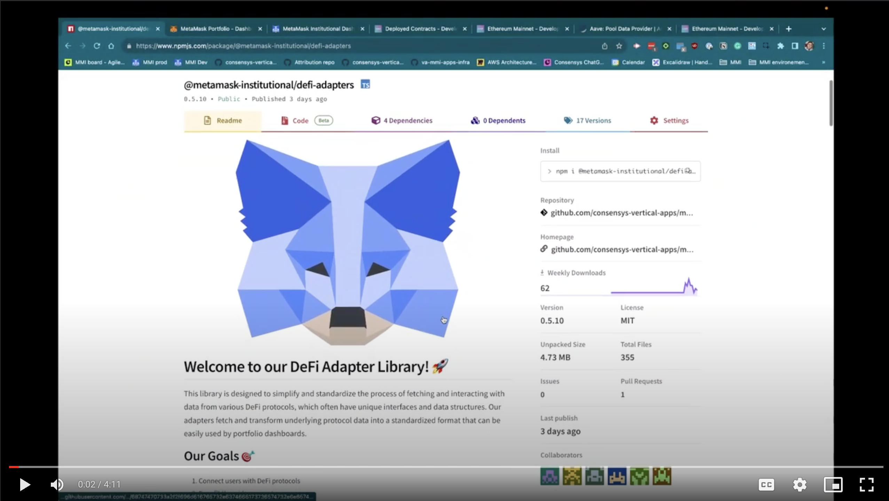
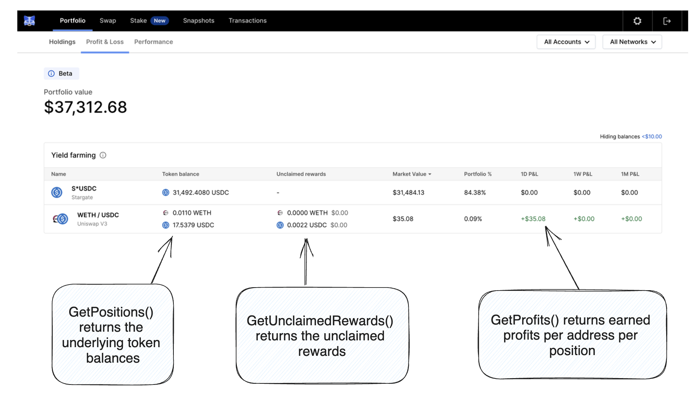
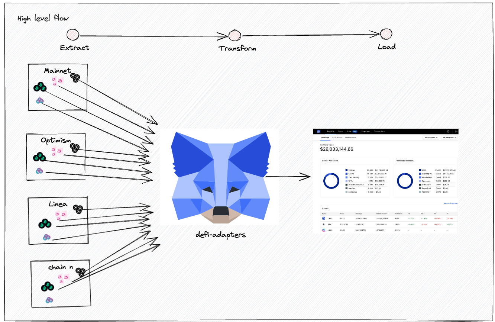

<p align="center">
  
</p>

# Welcome to our DeFi Adapter Library! 🚀

This library is designed to simplify and standardise the process of fetching data and interacting with various DeFi protocols, which often have unique interfaces and data structures. Our adapters 1) fetch and transform underlying protocol data into a standardised format that can be easily used by portfolio dashboards and 2) generate transaction params to create and update protocol positions.

## Our Goals 🎯

1. Connect users with DeFi protocols
2. Benefit the wider ecosystem
3. Simplify and standardise adapter building
4. Provide the following data in a standardised format:
   - DeFi positions by address, including the balance of underlying tokens such as USDC, WETH, etc.
   - Total Value Locked (TVL) by pool
   - Daily profit and loss by address
   - Unwrap LP tokens to the current unwrapping exchange rate
   - Deposits by address
   - Withdrawals by address
   - Crafted transactions params

## 🎥 DeFi Adapter Tutorial

Check out the tutorial video below for an intro to our library and how to build an adapter:

[](https://drive.google.com/file/d/1EL5PEOQa_OgscANi3mAxBXdT25LqMsKv/view)

## Adapter Template Overview

We offer a variety of templates to streamline the creation of new adapters using the command `npm run new-adapter`. Below is a detailed overview of each template available:

1. **DefaultAdapter Template**:
   - Provides a basic adapter class framework, including all essential methods that require implementation.
2. **SimplePoolAdapter Template**:
   - Generates an adapter class inheriting a set of pre-implemented methods.
   - Ideally suited for fungible liquidity pool (LP) tokens.
3. **LpStakingAdapter**:
   - Tailored for reward protocols, such as Convex.
   - Ideally suited for fungible staking tokens which are fixed one-to-one to the underlying LP token.
   - Supports optional Reward and Extra rewards functionalities.

Each template is designed to facilitate specific scenarios in the development of new adapters, ensuring a streamlined and efficient setup process.

Forks of popular protocols we also provide protocol-specific templates can be found [here](README.md#adapter-templates-for-forks-of-popular-protocols)

## Quick Start

This project requires Node 20. Ensure you're using the correct version (e.g. run `nvm use`)

To build an adapter follow these steps:

1. Install the necessary packages with `npm i`
2. Build the project with `npm run build:watch`
3. To build an adapter run:
   - `npm run new-adapter`
4. To create a typescript-smart-contract class create a json file with your abi and add it to your ${protocolName}/contracts/abis/ folder, then run:
   - `npm run build-types`
5. To build metadata files run (replace \<protocol-id> with the id of your protocol):
   - `npm run build-metadata -- -p <protocol-id>`
6. To build snapshot tests run (replace \<protocol-id> with the id of your protocol):
   - `npm run build-snapshots -- -p <protocol-id>`
7. To run tests run:
   - `npm run test`
8. To test your adapter further you can use the following commands, update userAddress and other params accordingly:
   - `npm run positions 0x6b8Be925ED8277fE4D27820aE4677e76Ebf4c255 -- --protocols stargate --chains 1,arbitrum`
   - `npm run profits 0xCEadFdCCd0E8E370D985c49Ed3117b2572243A4a`
   - `npm run tvl`
   - `npm run unwrap` (unwraps LP tokens to the current unwrapping exchange rate)
   - `npm run deposits 0x30cb2c51fc4f031fa5f326d334e1f5da00e19ab5 18262162 18262164 0xC36442b4a4522E871399CD717aBDD847Ab11FE88 pool uniswap-v3 1 573046`
   - `npm run withdrawals 0x4Ffc5F22770ab6046c8D66DABAe3A9CD1E7A03e7 17979753 17979755 0xdf0770df86a8034b3efef0a1bb3c889b8332ff56 pool stargate 1`

## Adapter Templates for Forks of Popular Protocols

We supply a set of templates that can be used for forks of popular protocols and products.

Using one of these templates can bootstrap a new protocol by just adding a few settings, such as a contract address or a graphql url to build the metadata files. Below is a detailed overview of each template available:

1. **UniswapV2PoolForkAdapter**:

   - Creates an adapter for Uniswap V2 fork projects. It requires:
     - Protocol details
     - Factory contract addresses for each chain
     - (Optional) URL for the subgraph for each chain

2. **CompoundV2SupplyMarketForkAdapter**:

   - Creates an adapter for the supply market of Compound V2 fork projects. It requires:
     - Protocol details
     - Comptroller contract addresses for each chain

3. **CompoundV2BorrowMarketForkAdapter**:
   - Creates an adapter for the borrow market of Compound V2 fork projects. It requires:
     - Protocol details
     - Comptroller contract addresses for each chain

## Documentation 📖

Detailed documentation on the adapter methods can be found [here](./docs/interfaces/IProtocolAdapter.IProtocolAdapter.md).

## Portfolio dashboard

The DeFi adapter library is the engine behind MetaMask's retail and institutional portfolio dashboards 🦊.

In this example, the user holds positions in both Stargate and Uniswap.



## Example adapter user story

> ### User Story: Implement New DeFi Adapter for [Your Protocol Name]
>
> **As a** adapter developer,  
> **I want to** implement a new DeFi adapter that follows the IProtocolAdapter interface,  
> **So that** MMI and MetaMask Portfolio users can view in-depth data related to their positions.
>
> ---
>
> #### Acceptance Criteria:
>
> 1. **Multiple Products Consideration:** Ensure that protocols with multiple products (e.g., farming, staking, pools) are supported by one adapter each.
> 2. **Adapter Implementation:** Successfully add a new DeFi adapter implementing the IProtocolAdapter to support the product.
> 3. **Add Adapter using CLI:**
>    - Follow instructions in the "Adding a new Adapter (CLI)" section of the readme.
> 4. **Ethers Contracts Creation:**
>    - Create ethers contracts to interact with the smart contracts of the protocol.
>    - Refer to the "Contract Factories" section in the readme for guidance.
> 5. **LP Token Metadata Building:** Implement the `buildMetadata()` logic in the adapter to retrieve the LP token reference data and run `npm run build-metadata`. (e.g., Check out the `buildMetadata()` method in the [`StargatePoolAdapter` class](https://github.com/consensys-vertical-apps/mmi-DeFi-adapters/blob/main/src/adapters/stargate/products/pool/stargatePoolAdapter.ts).
>    [output example](src/adapters/stargate/products/pool/metadata/ethereum.lp-token.json)).
> 6. **Testing:** Test the adapter(s) using the commands specified in the readme.
>
> ---
>
> #### Additional Notes/Comments:
>
> The IProtocolAdapter interface has been documented with TSDocs, detailed descriptions of the methods and properties can be found [here](./docs/interfaces/iProtocolAdapter.IProtocolAdapter.md).

## FAQ section

1. What is a DeFi adapter?

   A DeFi adapter is code that standardises DeFi protocol data and positions, allowing for consistent data retrieval and interaction. It acts as a connector (a.k.a translator) between our dashboards and your DeFi products.

2. What do these adapters do?

   They power the MetaMask portfolio dashboards, displaying users' DeFi positions.

3. What experience do I need to map an adapter?

   Ideally experience in Typescript, Ethers library, and be familiar with the DeFi protocol.

4. Are these adapters deployed onchain?

   No this adapter library is installed and deployed in microservices. The adapters are written in TypeScript (not solidity).

5. I'm not familiar with the protocol. Can I still map an adapter?

   Yes. To assist you refer to the protocol docs, smart contracts, find example open positions and review deposits and withdrawals to the position.

6. How long does it take to map an adapter?

   A few hours for those with knowledge of Typescript, Ethers, and the DeFi protocol.

7. How do you calculate profits?

   - We capture users' positions from 7 days ago using the `get positions` adapter method with a `blocknumber override`.
   - We then obtain the current positions.
   - To account for deposits and withdrawals in this period, we examine `mint` and `burn` events of LP tokens and convert these back to underlying tokens.
   - We found this method works for the majority of protocols. However, adapt as necessary for your protocol. For example, if there are better event logs available for your protocol, use them.

8. Some adapter methods don't make sense for my DeFi-protocol?

   Throw an error: new Error('Does not apply').

9. Can I use an API for results?

   We recommend getting data directly from the blockchain over centralized APIs.

10. My protocol only has a few pools, can I hardcode the buildMetadata() result?

    Yes. Feel free to hardcode this result if it doesn't make sense to fetch pool data on chain.

11. My protocol has more than one product, should I create separate adapters?

    Yes. We find this reduces complexity.

12. Im getting `>> TypeError: Cannot read properties of undefined (reading 'F_OK')` error when running `npm run new-adapter`

    Make sure you are using Node 20. Run `nvm use`

13. How can I share feedback or proposals?

    Please reach out to us directly. We value feedback.

## Overview of this library

From left to right, get-onchain-data and convert to standardise format.



## Getting Started 🏁

### Contributing

See [CONTRIBUTING.md](CONTRIBUTING.md).

### Requirements

- Node v20

### CLI Help

To get specific details on available commands, run `npm run adapters-cli`. For arguments and options for specific commands, use `npm run positions -- --help`.

### Adding a new Adapter (CLI)

This project requires Node 18. Ensure you're using the correct version (e.g. run `nvm use`)

Run the following command to add a new adapter `npm run new-adapter`

This will start an interactive process in the command line to create a new adapter. Running `npm run new-adapter -- --help` shows available options for defaults.

### Contract Factories

Add a JSON file with the ABI of any new contract to the folder `src/adapter/<protocol-name>/contracts/abis`. Run `npm run build-types` to generate factories and ABIs for those contracts automatically.

### Test Snapshots

In order to maintain integrity, it is possible to create test snapshots.

Tests can be added to `src/adapters/<protocol-name>/tests/testCases.ts` by adding them to the exported `testCases` array. The test object is fully typed.

A test needs to include:

- `chainId`: Chain for which the test will run
- `method`: One of the available public methods of the library
- `input`: If the test `method` requires input, such as an user address, it needs to be specified here.
- `blockNumber`: For some tests, it is possible to specify which block number should be used. If it's not provided, the snapshot will be created with the latest block number, which will be stored along with the snapshot.
- `key`: When there are multiple tests for the same `chainId` and `method`, but with different inputs (e.g. testing multiple user addresses), a key is necessary for the system to identify them.

Once the tests are DeFined, running `npm run build-snapshots -- -p <protocol-name>` will generate snapshots for them.

Running `npm run test` validates snapshots match results.

### Write Actions for adapters

Product adapters can implement the `getTransactionParams` method to return an object that can be used to form a transaction (usually `to` and `data`).

#### Determine the actions supported by the product adapter
First of all, it is necessary to determine what actions that product adapter supports. There's a list of available actions which can be extended when the needs arise (entries need to be added to [this constant declaration](src/types/writeActions.ts). The current supported actions are:
- Deposit
- Withdraw
- Borrow
- Repay

#### Create input schemas for every action
After that, an object called `WriteActionInputs` needs to be exported from that adapter file. The object includes a list of the available actions and the respective Zod schemas for the input.

We use Zod schemas because it is a popular library that allows us to create appropriate types in the background to validate the input. Here is a [list of primitives that Zod supports](https://zod.dev/?id=primitives).

That object needs to satisfy the type `WriteActionInputSchemas`. Here's a simple example implementation for an adapter that supported `deposit` and `withdraw`:

```
export const WriteActionInputs = {
  [WriteActions.Deposit]: z.object({
    asset: z.string(),
    amount: z.string(),
    onBehalfOf: z.string(),
    referralCode: z.number(),
  }),
  [WriteActions.Withdraw]: z.object({
    asset: z.string(),
    amount: z.string(),
    to: z.string(),
  }),
} satisfies WriteActionInputSchemas
```

After creating that input schema, and making sure that the project is building with `npm run build:watch`, it is necessary to run `npm run build-types` so that the types and schemas are correctly generated.

#### Implement getTransactionParams method logic
Implement the `getTransactionParams` method within your adapter.

The easier way is to set a switch statement using the `WriteAction` as discriminator, this should allow TypeScript language server to determine the correct type within the switch statement entry.

```
async getTransactionParams({
  action,
  inputs,
}: Extract<
  GetTransactionParams,
  { protocolId: typeof Protocol.YourProtocolKey; productId: 'YourProductId' }
>): Promise<{ to: string; data: string }> {
  switch (action) {
    case WriteActions.Deposit: {
      const { asset, amount, onBehalfOf, referralCode } = inputs
      return poolContract.supply.populateTransaction(
        asset,
        amount,
        onBehalfOf,
        referralCode,
      )
    }
    case WriteActions.Withdraw: {
      const { asset, amount, to } = inputs
      return poolContract.withdraw.populateTransaction(asset, amount, to)
    }
  }
}
```


## Versioning and Publishing (internal use only)

To version and publish:

1. Create a pull request with your changes.
2. Apply one of the labels: `major`, `minor`, `patch`, `premajor`, `preminor`, `prepatch`, or `prerelease` to the pull request. This label will determine how the package version is bumped.
3. Once your pull request is approved, merge it into `main`.
4. The GitHub Action workflow will automatically bump the package version based on the label, push the new version and associated tag, and then publish the package.

Please note: You no longer need to manually bump the package version or push tags.

## Update Average Blocks Per Day (internal use only)

To update all averages, run `npm run adapters-cli block-average`. To update a specific chain, run `npm run adapters-cli block-average -- --chain 1`.

# Contributors 🫡

<table>
  <tr>
    <td align="center"><a href="https://github.com/username1"><br><sub><b>Johann</b></sub></a></td>
    <td align="center"><a href="https://github.com/username2"><br><sub><b>Bernardo</b></sub></a></td>
    <td align="center"><a href="https://github.com/username3"><br><sub><b>JP</b></sub></a></td>
  </tr>
</table>
