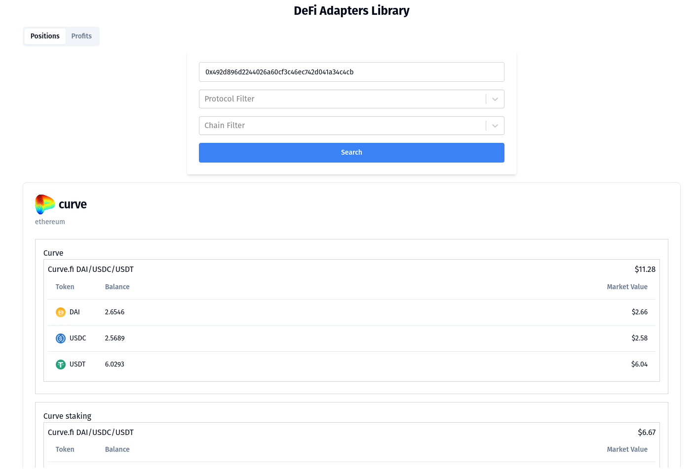

# Development UI for Adapters Library

## Getting started

Run the following command to start a web ui to display results from changes to the adapters library.

```
npm run dev
```

The UI will reload automatically with changes to the library.

Filter values will be stored as browser local storage to assist with page reloads. The values will be overwritten every time a search is started.

