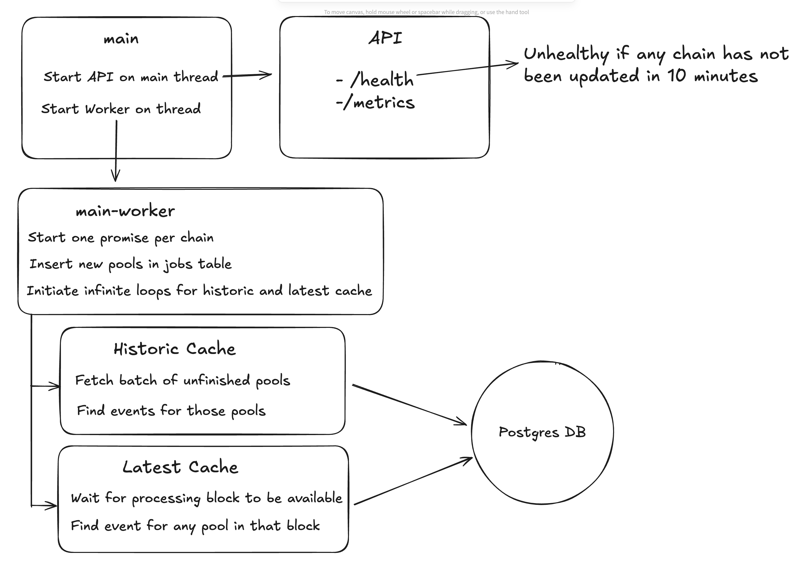

# Package Description
This package serves as the entry point for a worker process that scans every supported chain for events that will be used to determine all the pools a specific EVM address has had a DeFi position with.

# Architecture Overview

  

The process consists of:
- A single main thread that runs an API
- One worker thread per chain.

## Main process
Runs a Hono API instance that exposes `/health` and `/metrics` endpoints.

The `/health` endpoint receives a message from every worker thread every time a new block is processed. If no message is received from any worker thread within 10 minutes, the health check fails.

The `/metrics` endpoint is just the output of the prometheus client.

## Worker thread

Every supported chain has a worker thread that, after initialization, creates two infinite loops that run the following services:
- Latest Cache: Scans every block on the chain as they are being created and extracts the necessary events, which are then added to the DB. After every block is processed, a message is sent to the main thread.
- Historic Cache: When a new pool is introduced, it extracts all the necessary events that occurred from block 0 to the current block.

### Initialization
Every time a worker thread starts, the following steps occur:
- A database connection pool is created for that chain
- The latest processed block for that chain is used to initialize the process
    * If it's a new chain, the latest block for that chain is used
- The list of pools is updated; any new pools are added to the database using the latest processed block as reference for the two cache processes.
- The two cache processes are initialized.

## Database

There is a single PostgreSQL database. Each chain has its own schema with its own set of tables. All tables are identical.

### Tables
- `jobs`: This table has an entry for each supported DeFi pool and it includes information about the event and arguments that are needed to extract in order to determine if an address has had a position in that pool. It also includes the block in which the pool was added to the table, as well as whether it has finished processing all the previous blocks.

- `logs`: This is a very basic two-column table that indicates if an Ethereum address has had a position with a supported pool. The first column, important for indexing purposes, is the Ethereum address, the second one is the pool address. This table is only queried by Ethereum address so that it returns the list of pools that the address has had positions with.

- `settings`: This is a set of persisted keys and values. For the time being, it only stores the latest block processed for that chain.

- `migrations`: This table stores all the migrations that have been applied.

### Migrations

To make changes to the database tables, create a new migration file:
`packages/workers/src/database/migrations/<XXXX>-<DESCRIPTION>.ts`

Where `<XXXX>` is a sequential 4-digit number indicating the order in which migrations are applied and `<DESCRIPTION>` is a kebab-case description of the migration.

Each migration file must have a default export with the following signature:
`function (client: Pool): Promise<void>`

# Exports
The package also exports a series of utilities that are used in other packages of the repository (CLI and API)
- `buildPostgresPoolFilter`: Used to create the filter that reads the database to speed up queries.
- `createDbPool`: Utility to initialize a set of pools per chain that use the correct schema.
- `buildTokenEventMappings`: Utility that returns an array with all the supported pools and the event information needed from them.
- `createWatchKey`: Utility that returns a unique key for each pool and event.
- `processReceipts`: Utility that parses and returns the needed information from an array of transaction receipts.

# Observations
- When enough new chains are added, it is possible that having each worker use its own set of pools will exceed the number of connections allowed. If that occurs, it might be best to split the chains into multiple databases, as they do not interact with each other.

- This process is meant to run in a single pod. If it becomes difficult to scale the pod, multiple pods could run by splitting the chains between them.